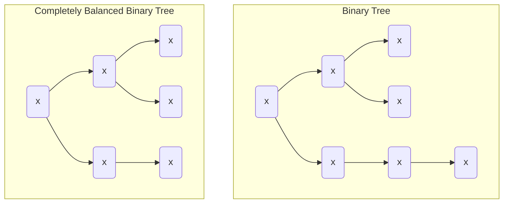

---
tags:
    - Tree
    - Intermediate
---

# Completely Balanced Binary Trees

A binary tree is either empty or it is made of a root element an 2 successors. The successors are binary trees. A completely balanced binary tree is a tree where the number of nodes on the left $N_L$ and the number of nodes on the right $N_R$  differ by at most 1 so $|N_L - N_R| \leq 1$. 

Generate all completely balanced binary trees for a given number of nodes. Put the letter 'x' as information into all nodes of the tree.




=== "Test"
    ```python
    def test_generate_trees(solution):
        assert solution(0) == [None]
        
        assert solution(4) == [
            Node(left=Node(left=None, right=None, value='x'), right=Node(left=None, right=Node(left=None, right=None, value='x'), value='x'), value='x'),
            Node(left=Node(left=None, right=None, value='x'), right=Node(left=Node(left=None, right=None, value='x'), right=None, value='x'), value='x'),
            Node(left=Node(left=None, right=Node(left=None, right=None, value='x'), value='x'), right=Node(left=None, right=None, value='x'), value='x'),
            Node(left=Node(left=Node(left=None, right=None, value='x'), right=None, value='x'), right=Node(left=None, right=None, value='x'), value='x')
        ]
    ```

=== "Recursive"
    ```python
    from __future__ import annotations
    from dataclasses import dataclass
    from itertools import product
    from functools import cache


    @dataclass
    class Node:
        left: Tree
        right: Tree
        value: str = 'x'

    type Tree = Node | None

    @cache
    def generate_completely_balanced_binary_trees_v1(nodes: int) -> list[Tree]:
        match nodes:
            case 0: 
                return [None]
            
            case 1: 
                return [Node(None, None)]
            
            case n if (remaining_nodes := n - 1) % 2 == 0:
                subtrees = generate_completely_balanced_binary_trees_v1(remaining_nodes // 2)
                return [Node(left, right) for left, right in product(subtrees, subtrees)]
            
            case n if (remaining_nodes := n - 1) % 2 == 1:
                smaller_subtrees = generate_completely_balanced_binary_trees_v1(remaining_nodes // 2)
                larger_subtrees = generate_completely_balanced_binary_trees_v1(remaining_nodes // 2 + 1)

                p1_trees = [Node(left, right) for left, right in product(smaller_subtrees, larger_subtrees)]
                p2_trees = [Node(left, right) for left, right in product(larger_subtrees, smaller_subtrees)]
                
                return p1_trees + p2_trees
    ```