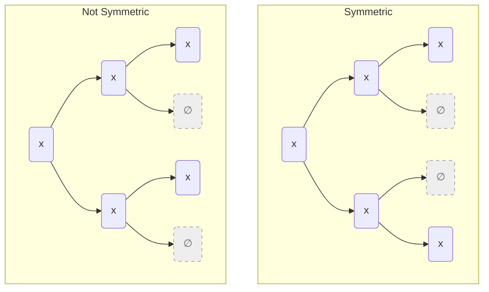

---
tags:
    - Tree
    - Intermediate
---

# Symmetric Binary Trees

A binary tree is symmetric if you can draw a vertical (horizontal if you look at the diagram) line through the root node and the right subtree $R_T$ is a mirror image of the left subtree $L_T$. We are only interested in the structure and not content of nodes.



=== "Test"
    ```python
    def test_is_symmetric_tree(solution):
        assert solution(Branch(None, None)) == True
        assert solution(Branch(Branch(None, Branch(None, None)), 
                               Branch(Branch(None, None), None))) == True
    ```

=== "Recursive"
    ```python
    from __future__ import annotations
    from dataclasses import dataclass

    @dataclass
    class Branch:
        left: Tree
        right: Tree

    type Tree = Branch | None

    def is_symmetric_tree_v1(tree: Tree) -> bool:
        match tree:
            case None: 
                return True
                
            case Branch(None, None): 
                return True

            case Branch(_, None) | Branch(None, _): 
                return False

            case Branch(left_tree, right_tree):
                return is_symmetric_tree_v1(Branch(left_tree.left, right_tree.right)) and\
                       is_symmetric_tree_v1(Branch(left_tree.right, right_tree.left))
    ```


=== "Recursive with Helper"
    ```python
    from __future__ import annotations
    from dataclasses import dataclass

    @dataclass
    class Branch:
        left: Tree
        right: Tree

    type Tree = Branch | None

    def is_symmetric_tree_v2(tree: Tree) -> bool:
        def is_mirror(left_tree: Tree, right_tree: Tree) -> bool:
            match (left_tree, right_tree):
                case (None, None): 
                    return True

                case (_, None) | (None, _): 
                    return False

                case (Branch(lt_left, lt_right), Branch(rt_left, rt_right)):
                    return is_mirror(lt_left, rt_right) and is_mirror(lt_right, rt_left)
                
        
        if tree is None: return True
        return is_mirror(tree.left, tree.right)
    ```