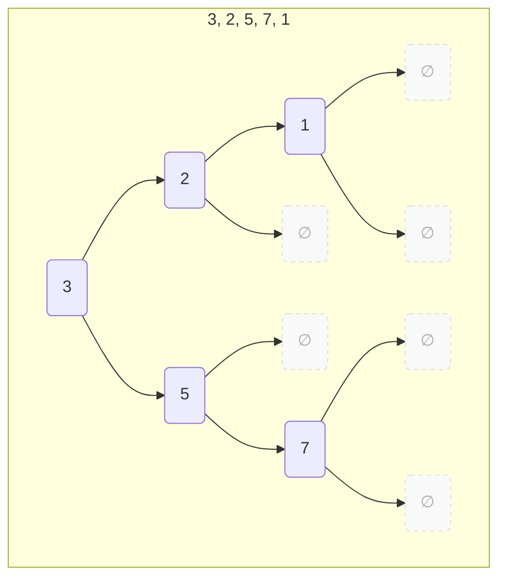

---
tags:
    - Tree
    - Intermediate
---

# Binary Search Tree

Construct a BST (binary search tree) from a list of integer numbers.



=== "Test"
    ```python
    def test_construct_bst(solution):
        assert solution([3, 2, 5, 7, 1]) == Node(3, 
                                                 Node(2, Node (1, None, None), 
                                                         None), 
                                                 Node(5, None, 
                                                         Node (7, None, None)))
    ```

=== "Recursive"
    ```python
    from __future__ import annotations
    from dataclasses import dataclass

    @dataclass
    class Node:
        value: int
        left: Tree
        right: Tree

    type Tree = Node | None

    def construct_bst_v1(lst: list[int]) -> Tree:
        if len(lst) == 0: return None
        
        def insert_into_bst(tree: Tree, num_to_insert: int):
            match tree:
                case Node(val, None, _) if num_to_insert < val:
                    tree.left = Node(num_to_insert, None, None)

                case Node(val, _, None) if num_to_insert >= val:
                    tree.right = Node(num_to_insert, None, None)

                case Node(val, lt, rt) if num_to_insert < val:
                    insert_into_bst(lt, num_to_insert)

                case Node(val, lt, rt) if num_to_insert >= val:
                    insert_into_bst(rt, num_to_insert)
        
        t = Node(lst[0], None, None)
        for elem in lst[1:]:
            insert_into_bst(t, elem)
        
        return t
    ```

=== "Recursive/No Mutation"
    ```python
    from __future__ import annotations
    from dataclasses import dataclass
    from functools import reduce

    @dataclass
    class Node:
        value: int
        left: Tree
        right: Tree

    type Tree = Node | None

    def construct_bst_v2(lst: list[int]) -> Tree:
        def insert_into_bst(tree: Tree, num_to_insert: int) -> Tree:
            match tree:
                case None:
                    return Node(num_to_insert, None, None)
                
                case Node(val, None, rt) if num_to_insert < val:
                    new_lt = Node(num_to_insert, None, None)
                    return Node(val, new_lt, rt)
                
                case Node(val, lt, None) if num_to_insert >= val:
                    new_rt = Node(num_to_insert, None, None)
                    return Node(val, lt, new_rt)
                
                case Node(val, lt, rt) if num_to_insert < val:
                    new_lt = insert_into_bst(lt, num_to_insert)
                    return Node(val, new_lt, rt)
                
                case Node(val, lt, rt) if num_to_insert >= val:
                    new_rt = insert_into_bst(rt, num_to_insert)
                    return Node(val, lt, new_rt)
        
        return reduce(insert_into_bst, lst, None)
    ```