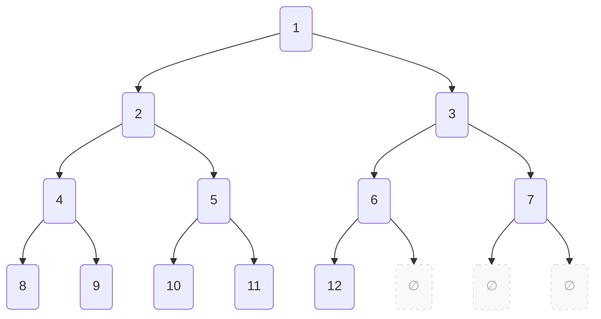

---
tags:
    - Tree
    - Intermediate
---

# Generate Complete Binary Tree

A complete binary tree (CBT) cannot have holes in any level above the last one. A CBT is left-adjusted so all nodes are packed to the left w/o gaps. Generate a CBT given $N$ nodes.




=== "Test"
    ```python
    def is_cbt_v1(tree: Tree, num_of_nodes: int) -> bool:
        nodes = deque([])
        
        if tree is not None: 
            nodes.append((tree, 1))

        expected_address = 1
        total_nodes_counted = 0

        while nodes:
            current_node, address = nodes.popleft()

            if address != expected_address or total_nodes_counted > num_of_nodes:
                return False
            
            expected_address += 1
            total_nodes_counted += 1

            if (left := current_node.left) is not None:
                nodes.append((left, 2 * address))

            if (right := current_node.right) is not None:
                nodes.append((right, 2 * address + 1))
        
        return total_nodes_counted == num_of_nodes


    def test_generate_complete_binary_tree(solution):
        assert is_cbt_v1(solution(0), 0)
        assert is_cbt_v1(solution(1), 1)
        assert is_cbt_v1(solution(2), 2)
        assert is_cbt_v1(solution(3), 3)
        assert is_cbt_v1(solution(8), 8)
        assert is_cbt_v1(solution(17), 17)
        assert is_cbt_v1(solution(17), 19) == False
    ```

=== "Recursive"
    ```python
    from __future__ import annotations
    from dataclasses import dataclass

    @dataclass
    class Node:
        left: Tree
        right: Tree
        value: str = 'x'

    type Tree = Node | None


    def generate_cbt_v1(n: int) -> Tree:
        def aux(n: int, address: int) -> Tree:
            match (n, address):
                case _ if (right_tree_address := 2*address + 1) <= n:
                    return Node(aux(n, right_tree_address - 1), aux(n, right_tree_address))
                
                case _ if (left_tree_address := 2*address) <= n:
                    return Node(aux(n, left_tree_address), None)
                
                case _ if address <= n:
                    return Node(None, None)
        
        if n == 0: return None
        return aux(n, 1)
    ```