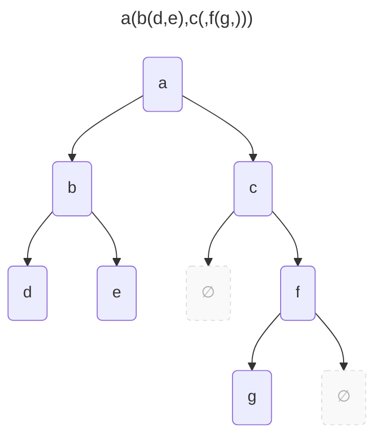

---
tags:
    - Tree
    - Intermediate
---

# Tree to String

Given a tree $T$, convert it into string format. 

```
∅ → ''
N(∅, ∅, a) → 'a'
N(N(∅, ∅, b), ∅, a) → 'a(b,)'
N(∅, N(∅, ∅, c), a) → 'a(,c)'
```




=== "Test"
    ```python
    def test_tree_to_string(solution):
        tree = Node('a', Node ('b', Node ('d', None, None), Node ('e', None, None)),
                         Node ('c', None, Node ('f', Node ('g', None, None), None)))
        assert solution(tree) == 'a(b(d,e),c(,f(g,)))'
    ```

=== "Recursive"
    ```python
    from __future__ import annotations
    from dataclasses import dataclass

    @dataclass
    class Node:
        value: str
        left: Tree
        right: Tree

    type Tree = Node | None

    def tree_to_string_v1(tree: Tree) -> str:
        match tree:
            case None: return ''
            case Node(value, None, None): return f'{value}'
            case Node(value, left, right):
                left_str = tree_to_string_v1(left)
                right_str = tree_to_string_v1(right)
                return f'{value}({left_str},{right_str})'
    ```