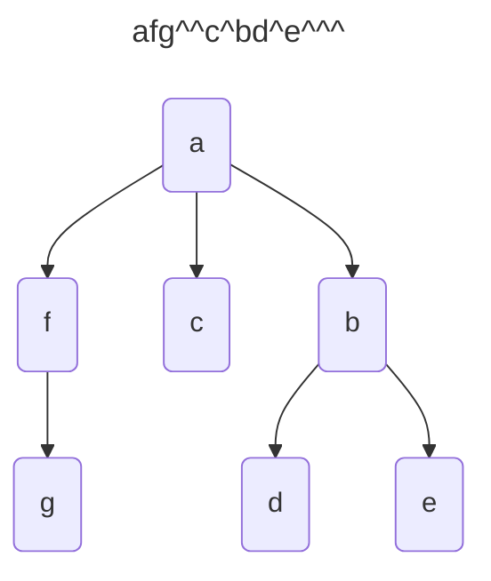

---
tags:
    - Tree
    - Intermediate
---

# Multiway Tree to String

A multiway tree has a root element and a list of multiway trees as successors. The nodes can contain any value.
In this case, they will contain single characters. 

A special character __^__ has been inserted during depth-first order traversal. 
This means to backtrack to the previous level. 

Given a multiway tree, generate its string representation.



=== "Test"
    ```python
    def test_tree_to_string(solution):
        tree = Node('a', [Node('f', [Node('g', [])]),
                          Node('c', [])])
        assert solution(tree) == 'afg^^c^^'
    ```

=== "Recursive"
    ```python
    from __future__ import annotations
    from dataclasses import dataclass

    @dataclass
    class Node:
        value: str
        successors: list[Tree]

    type Tree = Node


    def tree_to_string(tree: Tree) -> str:
        successors_str = ''.join(tree_to_string(st) for st in tree.successors)
        return tree.value + successors_str + '^'
    ```