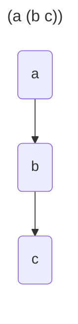
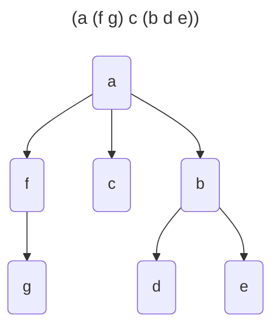

---
tags:
    - Tree
    - Intermediate
---

# Lisp-Like Tree Representation

Given a multiway tree $T$ output its lisp-like representation.
A node with children is always the first in a list, followed by its children. 
The lisp-like representation is a sequence composed of __<value\>__  or  __"("__  or  __")"__








=== "Test"
    ```python
    def test_lispy_tree_representation(solution):
        t = Node('a', [])
        assert solution(t) == 'a'

        t = Node('a', [Node('b', [])])
        assert solution(t) == '(a b)'

        t = Node('a', [Node('b', [Node('c', [])])])
        assert solution(t) == '(a (b c))'

        t = Node('a', [Node('b', []), Node('c', [])])
        assert solution(t) == '(a b c)'
    ```

=== "Recursive"
    ```python
    from __future__ import annotations
    from dataclasses import dataclass

    @dataclass
    class Node:
        value: str
        successors: list[Tree]

    type Tree = Node

    def lispy_tree_repr_v1(tree: Tree) -> str:
        match tree:
            case Node(val, []): 
                return val
            
            case Node(val, children):
                children_repr = ' '.join(lispy_tree_repr_v1(child) for child in children)
                return f'({val} {children_repr})'
    ```