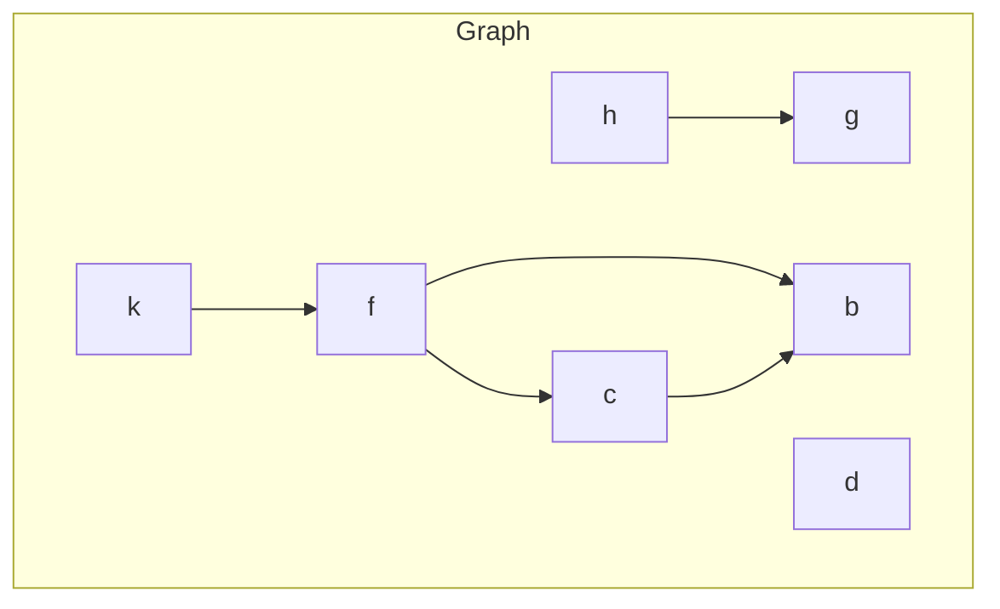

---
tags:
    - Graph
    - Intermediate
---

# Path From One Node to Another One

Given a graph $G$ in graph-term form. Find all paths from starting node $S$ to final node $F$.
```
G → (Nodes, Edges) → ([b, c, d, f, g, h, k], [(h, g), (k, f), (f, b), (f, c), (c, b)])
```



=== "Test"
    ```python
    def test_find_paths(solution):
        g = Graph(['b', 'c', 'd', 'f', 'g', 'h', 'k'],
                  [Edge('h', 'g'), Edge('k', 'f'), Edge('f', 'b'), 
                   Edge('f', 'c'), Edge('c', 'b')])
        
        assert set(solution(g, 'f', 'b')) == set([('f', 'c', 'b'), ('f', 'b')])
        assert set(solution(g, 'd', 'h')) == set([])
        assert set(solution(g, 'h', 'g')) == set([('h', 'g')])
    ```

=== "Recursive"
    ```python
    from __future__ import annotations
    from dataclasses import dataclass
    from collections import namedtuple

    Edge = namedtuple('Edge', ['start', 'end'])

    @dataclass
    class Graph[T]:
        nodes: list[T]
        edges: list[Edge]


    def find_paths_v1[T](graph: Graph, start: T, end: T) -> list[tuple[T]]:
        valid_paths = []

        def aux(curr_node: T, seen_nodes: set[T], curr_path: tuple[T]) -> None:
            if curr_node == end:
                valid_paths.append(curr_path)
                return

            for edge in graph.edges:
                if edge.start == curr_node and edge.end not in seen_nodes:
                    aux(edge.end, seen_nodes | {edge.end}, curr_path + (edge.end,))
        
        aux(start, {start}, (start,))
        return valid_paths
    ```

=== "Generator"
    ```python
    from __future__ import annotations
    from dataclasses import dataclass
    from collections import namedtuple
    from typing import Generator

    Edge = namedtuple('Edge', ['start', 'end'])

    @dataclass
    class Graph[T]:
        nodes: list[T]
        edges: list[Edge]

    
    def find_paths_v2[T](graph: Graph, start: T, end: T) -> list[tuple[T]]:
        def aux(curr_node: T, seen_nodes: set[T], curr_path: tuple[T]) -> Generator[tuple[T]]:
            if curr_node == end:
                yield curr_path
                return
            
            for edge in graph.edges:
                if edge.start == curr_node and edge.end not in seen_nodes:
                    yield from aux(edge.end, seen_nodes | {edge.end}, curr_path + (edge.end,))
        
        return list(aux(start, {start}, (start,)))
    ```