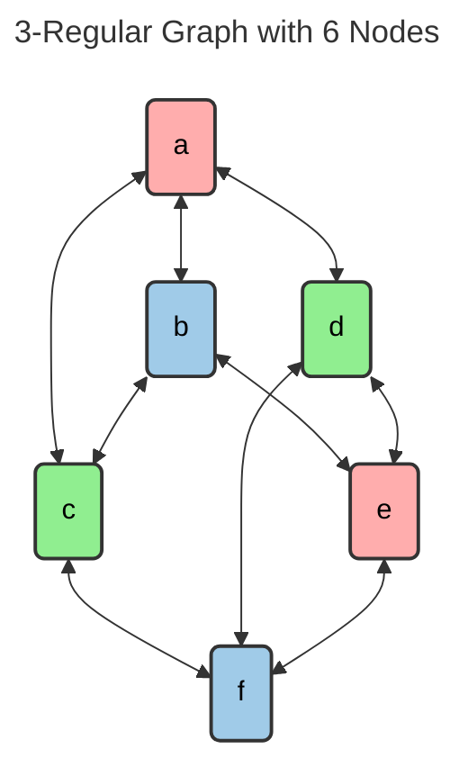
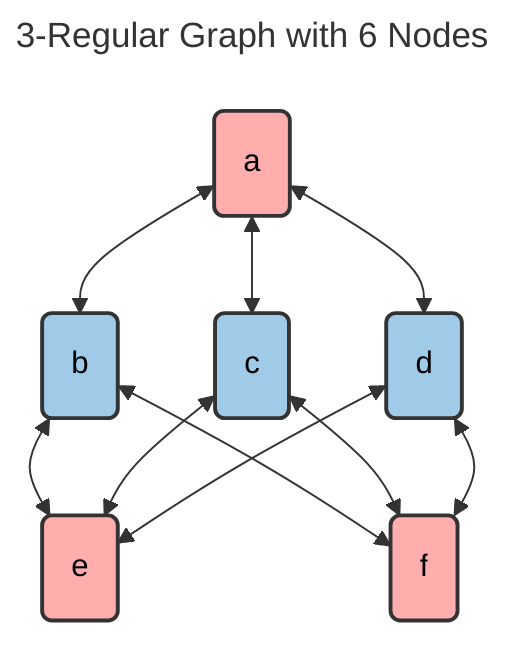

---
tags:
    - Graph
    - Advanced
---

# Find Non-Isomorphic K-Regular Graphs with N nodes

Find all non-isomorphic graphs that are [K regular](https://en.wikipedia.org/wiki/Regular_graph) and have N nodes. 







=== "Test"
    ```python
    def graph_from_str(g_str, num_nodes) -> Graph:
        nodes = [Node(str(i)) for i in range(1, num_nodes + 1)]
        edge_set = set()
        for pair in g_str.split(', '):
            start, end = pair.split('-')
            start_node = nodes[int(start) - 1]
            end_node = nodes[int(end) - 1]
            edge_set.add(Edge(start_node, end_node))
        
        return Graph(nodes, edge_set)

    # From https://www.ic.unicamp.br/~meidanis/courses/mc336/2009s2/prolog/problemas/p94.txt
    r2n3_str = "1-2, 1-3, 2-3"
    r2n3 = graph_from_str(r2n3_str, 3)

    r3n6_str = "1-2, 1-3, 1-4, 2-3, 2-5, 3-6, 4-5, 4-6, 5-6"
    r3n6 = graph_from_str(r3n6_str, 6)

    r5n8_str = "1-2, 1-3, 1-4, 1-5, 1-6, 2-3, 2-4, 2-5, 2-6, 3-4, 3-7, 3-8, 4-7, 4-8, 5-6, 5-7, 5-8, 6-7, 6-8, 7-8"
    r5n8 = graph_from_str(r5n8_str, 8)


    test_cases = [
        pytest.param(r2n3, 1, id="2 Regular 3 Node"),
        pytest.param(r3n6, 2, id="3 Regular 6 Node"),
        pytest.param(r5n8, 3, id="5 Regular 8 Node"),
    ]

    @pytest.mark.parametrize("graph, expected_result", test_cases)
    @pytest.mark.parametrize("solution", implementations, ids=ids)
    def test_find_non_isomorphic_k_regular_graphs(solution, graph, expected_result):
        assert len(solution(graph)) == expected_result
    ```

=== "Canonical Label"
    ```python
    from __future__ import annotations
    from dataclasses import dataclass
    import numpy as np
    from numpy import typing as npt
    from itertools import combinations, permutations
    from collections import deque
    from math import isqrt

    @dataclass(frozen=True)
    class Node:
        name: str

    @dataclass(frozen=True)
    class Edge:
        start: Node
        end: Node

    @dataclass
    class Graph:
        nodes: set[Node]
        edges: set[Edge]

        def get_adjacency_matrix(self) -> tuple[npt.NDArray[np.bool], list[str]]:
            sorted_nodes = sorted(list(self.nodes), key=lambda n: n.name)
            enumeration = {node: enum for enum, node in enumerate(sorted_nodes)}

            m = np.zeros((len(self.nodes), len(self.nodes)), dtype=bool)

            for edge in self.edges:
                start_idx = enumeration[edge.start]
                end_idx = enumeration[edge.end]
                m[start_idx][end_idx] = True
                m[end_idx][start_idx] = True

            return m

    type BitVector = npt.NDArray[np.bool]
    type BitString = str

    def find_non_isomorophic_graphs_v1(graph: Graph) -> set[BitString]:
        def to_bin_str(vec) -> str:
            return "".join(vec.astype(int).astype(str))

        def gen_next_graph(current_graph: BitVector, seen_graphs: set[BitString]) -> iter[BitVector]:
            num_of_nodes = isqrt(len(current_graph))
            zero_locs = np.where(current_graph == 0)[0]
            row_idx = zero_locs // num_of_nodes
            col_idx = zero_locs % num_of_nodes
            upper_tri_zero_coords = np.column_stack([row_idx[np.where(col_idx > row_idx)[0]], 
                                                     col_idx[np.where(col_idx > row_idx)[0]],])
            
            zero_pairings = combinations(upper_tri_zero_coords, 2)

            def map_coord(coord: tuple[int, int]) -> int:
                return coord[0] * num_of_nodes + coord[1]
            
            def invert_coord(coord: tuple[int, int]) -> tuple[int, int]:
                return coord[1], coord[0]
            
            def construct_edge_switched_graph(hole_coord_1, hole_coord_2, edge_coord_1, edge_coord_2) -> BitVector:
                # Picking a rectangle in the matrix with zeros on its diagonal and ones on its other diagonal (4 points)
                # Reflecting it across the diagonal (4 points)
                # Setting those 8 points in total

                coords_flipping_to_1 = [hole_coord_1, hole_coord_2, 
                                        invert_coord(hole_coord_1), invert_coord(hole_coord_2)]
                coords_flipping_to_0 = [edge_coord_1, edge_coord_2, 
                                        invert_coord(edge_coord_1), invert_coord(edge_coord_2)]
                
                new_graph = current_graph.copy()
                new_graph[[map_coord(c) for c in coords_flipping_to_1]] = True
                new_graph[[map_coord(c) for c in coords_flipping_to_0]] = False
                return new_graph

            for zero_coord_1, zero_coord_2 in zero_pairings:
                a, b = zero_coord_1
                c, d = zero_coord_2

                # First possible mapping
                has_edge_1 = current_graph[map_coord((a, c))]
                has_edge_2 = current_graph[map_coord((b, d))]

                if not (has_edge_1 and has_edge_2):
                    continue
                
                p1 = construct_edge_switched_graph(zero_coord_1, zero_coord_2, (a, c), (b, d))

                if (p1_bin_str := to_bin_str(p1)) not in seen_graphs:
                    seen_graphs.add(p1_bin_str)
                    yield p1
                    
                # Second possible mapping
                has_edge_1 = current_graph[map_coord((a, d))]
                has_edge_2 = current_graph[map_coord((b, c))]

                if not (has_edge_1 and has_edge_2):
                    continue

                p2 = construct_edge_switched_graph(zero_coord_1, zero_coord_2, (a, d), (b, c))
                
                if (p2_bin_str := to_bin_str(p2)) not in seen_graphs:
                    seen_graphs.add(p2_bin_str)
                    yield p2
        
        def generate_all_graphs(given_graph: Graph) -> set[BitString]:
            lookup = given_graph.get_adjacency_matrix()
            lookup_bin_str = "".join(lookup.flatten().astype(int).astype(str))
            seen_graphs = {lookup_bin_str}
            nodes = deque([lookup.flatten()])

            while nodes:
                current_graph = nodes.popleft()
                for generated_graph in gen_next_graph(current_graph, seen_graphs):
                    nodes.append(generated_graph)
            
            return seen_graphs
        
        def find_canonical_form(graph: BitString) -> BitString:
            num_of_nodes = isqrt(len(graph))
            perms = permutations(range(num_of_nodes))
            adj_matrix = np.array(tuple(graph), dtype=int).reshape(num_of_nodes, num_of_nodes)
            max_bit_vector = adj_matrix.flatten()

            for p in perms:
                permutated_matrix = adj_matrix[p, :][:, p]
                p_matrix_flat = permutated_matrix.flatten()
                diff_indices = np.where(p_matrix_flat != max_bit_vector)[0]

                if diff_indices.size != 0:
                    first_diff_indx = diff_indices[0]
                    if max_bit_vector[first_diff_indx] < p_matrix_flat[first_diff_indx]:
                        max_bit_vector = p_matrix_flat
            
            return to_bin_str(max_bit_vector)

        return {find_canonical_form(g) for g in generate_all_graphs(graph)}
    ```

=== "Mismatch Hueristic"
    ```python
    from __future__ import annotations
    from dataclasses import dataclass
    import numpy as np
    from numpy import typing as npt
    from itertools import combinations, permutations
    from collections import deque
    from math import isqrt

    @dataclass(frozen=True)
    class Node:
        name: str

    @dataclass(frozen=True)
    class Edge:
        start: Node
        end: Node

    @dataclass
    class Graph:
        nodes: set[Node]
        edges: set[Edge]

        def get_adjacency_matrix(self) -> tuple[npt.NDArray[np.bool], list[str]]:
            sorted_nodes = sorted(list(self.nodes), key=lambda n: n.name)
            enumeration = {node: enum for enum, node in enumerate(sorted_nodes)}

            m = np.zeros((len(self.nodes), len(self.nodes)), dtype=bool)

            for edge in self.edges:
                start_idx = enumeration[edge.start]
                end_idx = enumeration[edge.end]
                m[start_idx][end_idx] = True
                m[end_idx][start_idx] = True

            return m

    type BitVector = npt.NDArray[np.bool]
    type BitString = str
    type PermSwap = tuple

    def find_non_isomorphic_graphs_v2(graph: Graph) -> set[BitString]:
        def to_bin_str(vec) -> str:
            return "".join(vec.astype(int).astype(str))
        
        def to_bit_vector(bitstr: BitString) -> BitVector:
            nodes = isqrt(len(bitstr))
            adj_matrix = np.array(tuple(bitstr), dtype=int).reshape(nodes, nodes)
            return adj_matrix.flatten()
        
        def compose_perm_swap(init_state: tuple, idxs_to_swap: tuple[int, int]) -> tuple:
            i, j = idxs_to_swap
            copied = list(init_state)
            copied[i], copied[j] = init_state[j], init_state[i]
            return tuple(copied)
        
        def hole_edge_matches(all_edge_missing_coord, all_hole_missing_coords) -> iter[tuple[int, int]]:
            for missing_edge_coord in all_edge_missing_coord:
                row, col = missing_edge_coord
                horizontal_matches = all_hole_missing_coords[all_hole_missing_coords[:, 0] == row]
                vertical_matches = all_hole_missing_coords[all_hole_missing_coords[:, 1] == col]
                
                yield from ((int(col), int(e[1])) for e in horizontal_matches)
                yield from ((int(e[0]), int(row)) for e in vertical_matches)
        
        def is_isomorphic(og_graph: BitVector, eg_graph: BitVector) -> bool:
            num_of_nodes = isqrt(len(og_graph))

            og_mat = og_graph.reshape(num_of_nodes, num_of_nodes)
            eg_mat = eg_graph.reshape(num_of_nodes, num_of_nodes)

            nodes = deque([(tuple(range(num_of_nodes)), 0)])
            seen_diffs = set()
            seen_perms = set()

            while nodes:
                curr_prem, num_of_swaps = nodes.popleft()

                perm_applied_mat = og_mat[curr_prem, :][:, curr_prem]
                diff_mat = eg_mat - perm_applied_mat

                if (diff_mat_bin_str := to_bin_str(diff_mat.flatten())) in seen_diffs:
                    continue

                seen_diffs.add(diff_mat_bin_str)

                edge_missing_coords = np.column_stack(np.where(diff_mat == -1))
                hole_missing_coords = np.column_stack(np.where(diff_mat == 1))

                if len(edge_missing_coords) == 0 and len(hole_missing_coords) == 0:
                    return True
                
                upper_tri_edge_missing_coords = edge_missing_coords[edge_missing_coords[:, 1] > edge_missing_coords[:, 0]]
                upper_tri_hole_missing_coords = hole_missing_coords[hole_missing_coords[:, 1] > hole_missing_coords[:, 0]]

                possible_swaps = hole_edge_matches(upper_tri_edge_missing_coords, upper_tri_hole_missing_coords)
                
                for idxs_to_swap in possible_swaps:
                    perm_after_ps = compose_perm_swap(curr_prem, idxs_to_swap)
                    if perm_after_ps not in seen_perms:
                        seen_perms.add(perm_after_ps)
                        nodes.append((perm_after_ps, num_of_swaps + 1))

            return False
        
        def gen_next_graph(current_graph: BitVector, seen_graphs: set[BitString]) -> iter[BitVector]:
            num_of_nodes = isqrt(len(current_graph))
            zero_locs = np.where(current_graph == 0)[0]
            row_idx = zero_locs // num_of_nodes
            col_idx = zero_locs % num_of_nodes
            upper_tri_zero_coords = np.column_stack([row_idx[np.where(col_idx > row_idx)[0]], 
                                                    col_idx[np.where(col_idx > row_idx)[0]],])
            
            zero_pairings = combinations(upper_tri_zero_coords, 2)
            
            def map_coord(coord: tuple[int, int]) -> int:
                return coord[0] * num_of_nodes + coord[1]
            
            def invert_coord(coord: tuple[int, int]) -> tuple[int, int]:
                return coord[1], coord[0]

            def construct_edge_switched_graph(hole_coord_1, hole_coord_2, edge_coord_1, edge_coord_2) -> BitVector:
                # Picking a rectangle in the matrix with zeros on its diagonal and ones on its other diagonal (4 points)
                # Reflecting it across the diagonal (4 points)
                # Setting those 8 points in total

                coords_flipping_to_1 = [hole_coord_1, hole_coord_2, 
                                        invert_coord(hole_coord_1), invert_coord(hole_coord_2)]
                coords_flipping_to_0 = [edge_coord_1, edge_coord_2, 
                                        invert_coord(edge_coord_1), invert_coord(edge_coord_2)]
                
                new_graph = current_graph.copy()
                new_graph[[map_coord(c) for c in coords_flipping_to_1]] = True
                new_graph[[map_coord(c) for c in coords_flipping_to_0]] = False
                return new_graph

            for zero_coord_1, zero_coord_2 in zero_pairings:
                a, b = zero_coord_1
                c, d = zero_coord_2

                # First possible mapping
                has_edge_1 = current_graph[map_coord((a, c))]
                has_edge_2 = current_graph[map_coord((b, d))]

                if not (has_edge_1 and has_edge_2):
                    continue
                
                p1 = construct_edge_switched_graph(zero_coord_1, zero_coord_2, (a, c), (b, d))

                if (p1_bin_str := to_bin_str(p1)) not in seen_graphs:
                    seen_graphs.add(p1_bin_str)
                    yield p1
                    
                # Second possible mapping
                has_edge_1 = current_graph[map_coord((a, d))]
                has_edge_2 = current_graph[map_coord((b, c))]

                if not (has_edge_1 and has_edge_2):
                    continue

                p2 = construct_edge_switched_graph(zero_coord_1, zero_coord_2, (a, d), (b, c))
                
                if (p2_bin_str := to_bin_str(p2)) not in seen_graphs:
                    seen_graphs.add(p2_bin_str)
                    yield p2
        
        
        lookup = graph.get_adjacency_matrix()
        lookup_bin_str = to_bin_str(lookup.flatten())
        lookup_bin_vec = to_bit_vector(lookup.flatten())

        non_isomorophic_graphs = [lookup_bin_vec]
        seen_graphs = {lookup_bin_str}
        nodes = deque([lookup_bin_vec])

        while nodes:
            current_graph = nodes.popleft()
            for edge_switched_graph in gen_next_graph(current_graph, seen_graphs):                    
                is_iso_graph = any((is_isomorphic(non_iso_graph, edge_switched_graph) 
                                    for non_iso_graph in non_isomorophic_graphs[::-1]))
                
                if not is_iso_graph:
                    nodes.append(edge_switched_graph)
                    non_isomorophic_graphs.append(edge_switched_graph)
        
        return {to_bin_str(g) for g in non_isomorophic_graphs}
    ```
